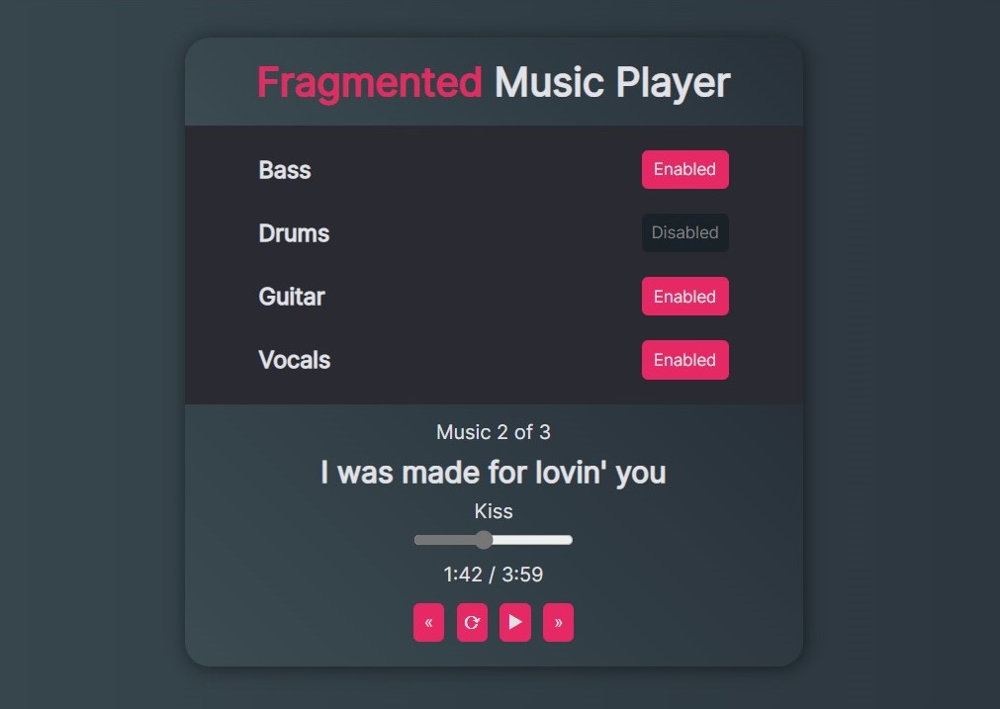

# Fragmented Music Player

Prototype of a music player that allows the user to select which instrumental tracks he wants to enable and disable in each song.

[🔗 Click here to access the project!](https://andreluizigal.github.io/fragmented-music-player/)
## 🛠️ Technologies
- JavaScript
    - React JS
    - Next.js
- HTML
- CSS

## 📞 Contact
- [andreluizigal@gmail.com 📧](mailto:andreluizigal@gmail.com)

- [+5585999851991 ☎️](https://wa.me/5585999851991)
